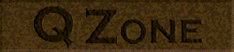

# QZONE FGD PROJECT
---

An attempt to create an FGD entity definition file for Qzone, a quake expansion sold in the 90s by the now defunct WizardWorks Group, Inc. This expansion adds new enemies and weapon replacements to the original Quake. I'm working on this project so that modders can create maps for the mod, and to make it easier for the entities unique to Qzone to be used in other mods.

Read [QZONE.TXT](QZONE.TXT), the original readme included in the CD, for more details about the mod.

## TO DO:
### ✅ Add new enemies to [qzone.fgd](qzone.fgd):
✅ flyer

✅ headless

✅ nuker

✅ nukermad

✅ plane

✅ snapper

### ✅ Make sure the nailgun replacement (slicer) works correctly
### ✅ Create Test Maps
### ☐ Bugtest
- Game crashes when nuker fires a flier
- Game crashes when nuker gibs
- Flyer has a missing precache, I'm unable to find it though
- Snapper stays still unless player is on top of it, attacks are broken

## CREDITS:
- Original mod created by WizardWorks
- The uncredited mappers who made the original maps
- ThatSpacePirate: Main developer
- Madfox: Helped decompile original QuakeC Source and extract textures
- [Librequake](https://github.com/lavenderdotpet/LibreQuake) for developer textures